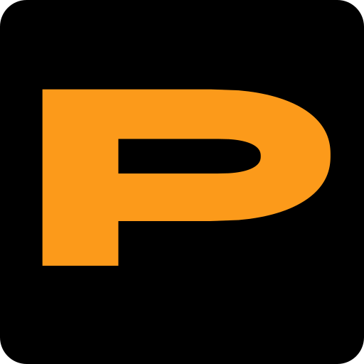

# Sintec.PDF app icon



**Design:** Sintec LLC's Sintec.PDF logo: a wide, heavy orange **P** on a black rounded square.

**Palette:** exactly two colours.

| Colour | Hex | Used for |
|---|---|---|
| Black | `#000000` | the full-bleed tile |
| Sintec orange | `#FC9A1A` | the P |

**Tile:** `viewBox="0 0 512 512"`, a rounded square with `rx=37.5`, full bleed. Windows and Linux icons use
the full-bleed tile. macOS icons put it on Apple's grid (an 824 px body centred on a transparent 1024 px
canvas).

**Provenance:** Sintec LLC's 163 px logo PNG, rebuilt as a vector rather than traced pixel by pixel: the
stem and bars are straight lines at the measured positions, and the bowl and the counter are superellipses
(exponents 2.3 and 2.4) fitted to the logo's edges by least squares (0.4 px RMS at the source size). Drawn
back at 163 px, the vector matches the source PNG to a mean difference of 0.4/255. The file names keep the
upstream `pdfcraft` stem because the build, the MSI and the app refer to them.
Licence: [LICENSE.txt](LICENSE.txt) (`MIT OR Apache-2.0` for the files; the Sintec names and logos remain
Sintec LLC's trademarks).

## Files

| File | What it is |
|---|---|
| `pdfcraft.svg` | the master vector; every PNG, `.ico` and `.icns` is rendered from it |
| `pdfcraft-small.svg` | the same vector, for places that link the small file, such as this README |
| `pdfcraft-1024.png` | 1024 px on Apple's grid; also the runtime Dock icon on macOS |
| `pdfcraft.icns` | macOS icon (16–1024 px) |
| `pdfcraft.ico` | Windows icon (16–256 px), embedded in the app exe (shipped as `sintec-pdf.exe`) by `apps/pdfcraft/build.rs` |
| `hicolor/<n>x<n>/apps/ai.storyteller.pdfcraft.png` | Linux hicolor theme, 16–512 px; the 256 px one is the runtime icon on Windows and Linux |
| `hicolor/scalable/apps/ai.storyteller.pdfcraft.svg` | Linux scalable icon (copy of the master) |

Where it shows: `apps/pdfcraft/src/main.rs` sets the window icon (Dock, taskbar, Alt-Tab, launcher) and the
Wayland app id `ai.storyteller.pdfcraft`; `packaging/linux/ai.storyteller.pdfcraft.desktop` names the
hicolor icon.

## Regenerate

```sh
packaging/icons.sh        # needs resvg and python3; iconutil (macOS) for the .icns
cargo xtask assets        # then update the sha256 values in ATTRIBUTION.toml and run with --write
```
